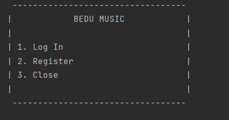

<h1> Bedu Music </h1>

## ¿Qué es Bedu Music?

Bedu Music es una aplicacion destinada para dispositivos moviles con tematica de musica. Para fines de aprendizaje se realizó una copia de la famosa aplicacion
"Spotify" que intenta replicar algunas de sus acciones y caracteristicas mas importantes.

## ¿Cómo funciona Bedu Music?

Para empezar la aplicación muestra el siguiente menú:

  

## ¿Cómo puedo comenzar a usar Bedu Music localmente?

Para hacer uso de nuestra aplicacion basta con ejecutar el main principal y a continuación realizar las instrucciones que detalladamente indique la interfaz.

## IMPORTANTE

Para poder realizar las acciones que presenta Bedu Music es importante iniciar sesion con usuarios registrados. Los usuarios se crean al hacer el registro en la aplicacion y estos son guardados en archivos de texto con usuarios y contraseñas. Por defecto ya hay un usuario registrado que puede usarse para hacer pruebas
a continuación mostramos las credenciales:

**Nombre de usuario:** root
**Contraseña:** 1234

## Features

BEDU MUSIC es desarrollada usando tecnologías como:

- :iphone: **Kotlin**: La mayoria del desarrollo de esta aplicacion fué construído en Kotlin.

- :computer: *Java*: Para demostrar la interoperabilidad con Kotlin se agregaron algunas funcionalidades de Java al proyecto.

- :gear: **Best Practices**: Flujo de trabajo sólido para mantener el código limpio y estructurado.

## ¿Quienes mantienen y contribuyen a TURI?

|  Elias Balbuena|  Paulina Quinteroo|  Gabriel Balbuena|  Ali Villegas ||
| --- | --- | --- | --- | --- |
| EliasBalbuena | PaulinaQuintero | AdanGabrielBalbuenaLuna| AliVillegas95 |

 

GRACIAS POR USAR BEDU MUSIC
