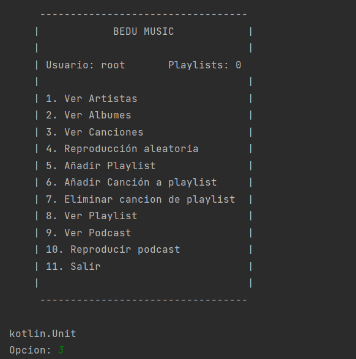
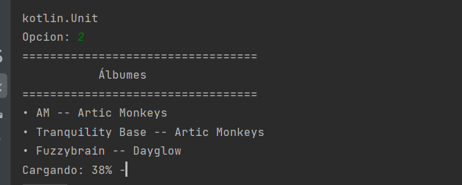
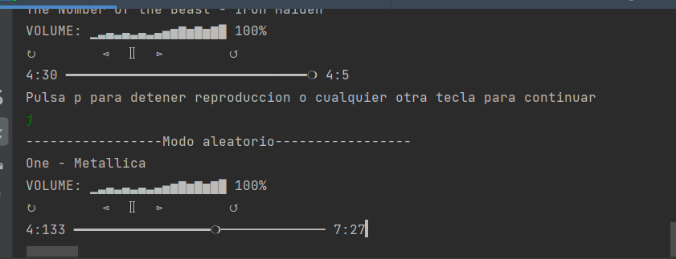
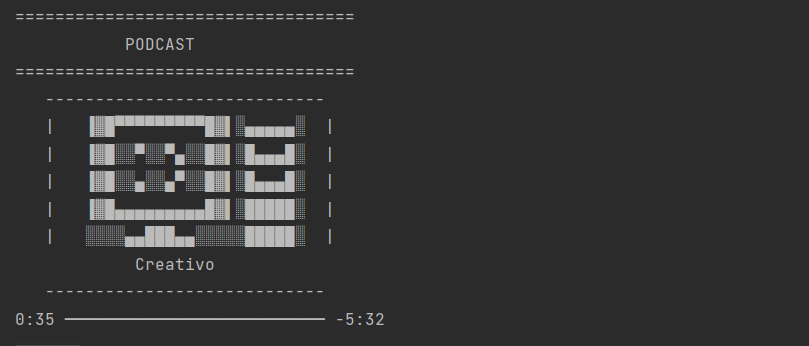
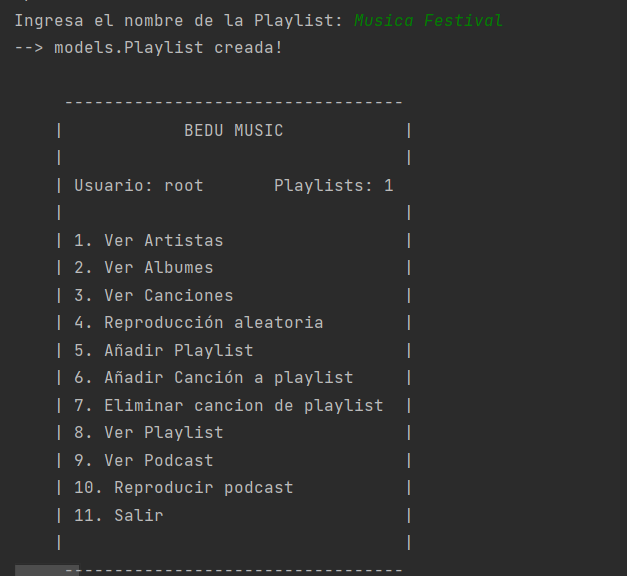

<h1> Bedu Music </h1>

## ¿Qué es Bedu Music?

Bedu Music es una aplicacion destinada para dispositivos moviles con tematica de musica. Para fines de aprendizaje se realizó una copia de la famosa aplicacion
"Spotify" que intenta replicar algunas de sus acciones y caracteristicas mas importantes.

## ¿Cómo funciona Bedu Music?

Para empezar la aplicación muestra el siguiente menú:

  

No se le mostrará el siguiente menú al usuario si antes no está registrado y logeado. Una vez que inicie sesión y dependiendo de si nuestra simulación de servidor te da acceso (esta es generado por un algoritmo al azar), se visualizará el siguiente menú:

  

En ese menú el usuario podrá elegir hacer lo de la lista, como visualizacion de artistas, podcasts, albumes, canciones, añadir Playlists, añadir o eliminar
canciones a las playlists, reproducir canciones, reproducir los podcasts entre otros.
La carga de información se ve algo asi:

  

La reproduccion de canciones puede ser aleatoriamente, reproduccion ascendente o descendente a partir de la cancion que el usuario indique o la repetición de una cancion en especifico.
Esta reproducción se ve algo asi:

  

De la misma forma, siguiendo el menú de arriba se pueden reproducir los Podcasts:

  

Si se añaden Playlists al usuario, esto se visualizaría en el menú del usuario y se vería de esta manera:

  

Se puede explorar la pagina tanto como se quiera, aqui se mostraron solo algunas de las funcionalidades, todo esto se logró aplicando todos los temas y conceptos
aprendidos a lo largo del curso de Kotlin.

## ¿Cómo puedo comenzar a usar Bedu Music localmente?

Para hacer uso de nuestra aplicacion basta con ejecutar el main principal y a continuación realizar las instrucciones que detalladamente indique la interfaz.

## IMPORTANTE

Para poder realizar las acciones que presenta Bedu Music es importante iniciar sesion con usuarios registrados. Los usuarios se crean al hacer el registro en la aplicacion y estos son guardados en archivos de texto con usuarios y contraseñas. Por defecto ya hay un usuario registrado que puede usarse para hacer pruebas
a continuación mostramos las credenciales:

**Nombre de usuario:** root
 
**Contraseña:** 1234

## Features

BEDU MUSIC es desarrollada usando tecnologías como:

- :iphone: **Kotlin**: La mayoria del desarrollo de esta aplicacion fué construído en Kotlin.

- :computer: *Java*: Para demostrar la interoperabilidad con Kotlin se agregaron algunas funcionalidades de Java al proyecto.

- :gear: **Best Practices**: Flujo de trabajo sólido para mantener el código limpio y estructurado.

## ¿Quienes mantienen y contribuyen a BEDU MUSIC?

|  Elias Balbuena|  Paulina Quintero|  Gabriel Balbuena|  Ali Villegas ||
| --- | --- | --- | --- | --- |
| EliasBalbuena | PaulinaQuintero | AdanGabrielBalbuenaLuna| AliVillegas95 |

 

GRACIAS POR USAR BEDU MUSIC

